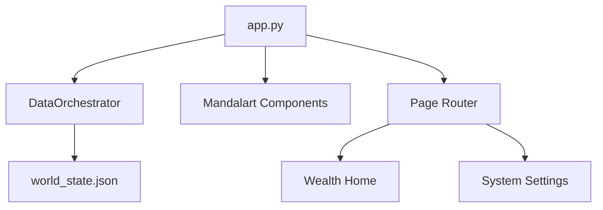

# System Spec: Mandalart Dashboard & Vision UI

## 1. 개요 (Overview)
본 모듈은 OMNI 시스템의 메인 진입점(`app.py`)으로, `DataOrchestrator`에서 공급되는 데이터를 기반으로 마스터의 삶의 영역(Mandalart)을 시각화하고 라우팅을 총괄한다.

## 2. 시스템 아키텍처 (Architecture)

## 3. 데이터 바인딩 규약 (Data Binding)

UI 컴포넌트는 `DataOrchestrator.read_state()` 결과물을 다음 규칙에 따라 바인딩한다.

| UI Component | Data Path | Display Logic |
|:---|:---|:---|
| **Wealth Card** | `data.portfolio.summary` | `total_krw` 표시, `daily_pnl_pct`에 따라 색상(Red/Blue) 결정 |
| **Briefing Header**| `data.intelligence` | `screener_results` 상위 3개를 AI 요약 템플릿에 주입 |
| **Sync Status** | `metadata.last_full_check`| "마지막 업데이트: X분 전" 형식으로 변환 노출 |

## 4. 핵심 컴포넌트 설계

### 4.1 `render_briefing_header()`
- **Logic**: 
    1. 오케스트레이터에서 `intelligence` 섹션 로드.
    2. 데이터가 `is_stale`이면 "시장 데이터를 가져오는 중입니다..." 표시.
    3. 정상 데이터면 마스터를 위한 환영 인사 및 주요 퀀트 시그널 요약 노출.

### 4.2 `render_mandalart_grid()`
- **Structure**: 3x3 정적 그리드 레이아웃.
- **State Handling**: 각 카드의 'Status'는 `world_state.json`의 해당 섹션 존재 여부로 판단. (없으면 `Locked`)

### 4.3 `Navigation & Router`
- `st.session_state.current_page`를 유일한 상태 소스로 사용.
- 페이지 전환 시 `st.rerun()`을 호출하여 상태를 즉시 반영.

## 5. 예외 처리 (Error Handling)
- **Cold Start**: `world_state.json`이 없을 경우 `DataOrchestrator.initialize()`를 즉시 실행하여 기본 구조 생성.
- **Broken Data**: JSON 파싱 실패 시 'System Emergency Reset' 버튼을 노출하여 수동 초기화 유도.

## 6. 스타일 규약 (UI Standard)
- **Color Palette**: 
    - Background: `#0E1117` (Streamlit Default Dark)
    - Primary: `#3182F6` (Deep Blue)
    - Positive: `#FF4B4B` (Red - 한국 주식 기준)
    - Negative: `#1C7ED6` (Blue - 한국 주식 기준)
