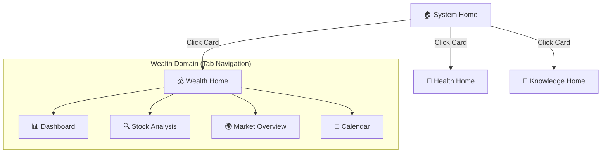

# GEM: OMNI - Wealth Domain UX/UI Master Plan

> **문서 버전**: v1.0
> **작성일**: 2026-01-31
> **목표**: 사용자 중심의 직관적 네비게이션과 전문적인 투자 분석 환경 구축

---

## 1. 🏗️ 시스템 아키텍처 (Hierarchy)

시스템을 3단계 깊이(Depth)로 구조화하여 정보의 복잡도를 관리한다.

### 핵심 변경 사항
1.  **드롭박스 메뉴 제거**: 최상위 레벨 이동은 `System Home`의 **카드(Cards)**로 수행.
2.  **도메인 내 이동**: `Wealth Home` 진입 후에는 상단 **탭(Tabs)**으로 기능 간 즉시 전환.
3.  **사이드바**: 전역 설정(API 키, 테마) 및 로그 확인용으로만 축소 사용.

---

## 2. 📱 화면별 상세 설계 (Detailed Specs)

### 🏠 Level 1: System Home (`app.py`)
**Role**: 시스템 상태 요약 및 도메인 진입점 (Lobby)

**Layout**:
- **Header**: 로고, 인사말 ("Good Morning, Master."), 현재 시각.
- **Main Grid (2x2)**:
    - **[💰 WEALTH CARD]**
        - 표시 정보: 총 자산(₩), 오늘의 손익(%), 주요 알림(리밸런싱 필요 등).
        - Action: 클릭 시 `pages/wealth_home.py`로 이동.
    - **[💪 HEALTH CARD]** (Placeholder)
    - **[🧠 KNOWLEDGE CARD]** (Placeholder)
- **Footer**: 시스템 Health Check 상태 (Green/Red).

---

### 💰 Level 2: Wealth Home (`pages/wealth_home.py`)
**Role**: 재정 관리의 모든 기능을 수행하는 통합 워크스페이스.
**Navigation**: Streamlit Native Tabs (`st.tabs`) 사용.

#### 📑 Tab 1: Dashboard (내 자산)
**Focus**: "내 돈이 안전한가? 무엇을 해야 하는가?"

1.  **KPI Row (최상단)**
    - 총 자산 | 일일 손익 | 현금 비중 | 환율(USD/KRW)
2.  **Core-Satellite Insight (좌우 분할)**
    - **Left (Chart)**: Core vs Satellite 비중 (도넛 차트). 목표 비중 대비 현재 상태 시각화.
    - **Right (Action)**: "리밸런싱 제안". (예: "Core 비중이 45%로 낮습니다. QQQ 추가 매수 권장.")
3.  **Holdings Table**: 보유 종목 리스트 (수익률 히트맵 적용).

#### 📑 Tab 2: Stock Analysis (종목 분석)
**Focus**: "전문가 수준의 심층 분석 (Deep Dive)"

1.  **Search Bar**: 티커 입력 (자동완성 지원).
2.  **Snapshot Header**: 현재가, 등락률, 52주 범위, 시가총액.
3.  **Main Analysis Grid**:
    - **Fundamental**: 실적 추세(매출/이익), 마진율.
    - **Valuation**: PER, PBR, PEG (게이지 차트).
    - **Peer Comparison**: 경쟁사 대비 우위 요소.
    - **AI Opinion**: "매수/매도/보류" 및 근거 요약.
4.  **Simulation**: "이 종목 매수 시 내 포트폴리오 변화" (Core 비중 변화 등).

#### 📑 Tab 3: Market Overview (시장 정보)
**Focus**: "시장 흐름 파악 및 기회 포착"

1.  **Macro Indicators**: 지수(S&P500, NASDAQ), 공포/탐욕 지수, 금리/환율.
2.  **Sector Heatmap**: 오늘의 강세/약세 섹터 시각화.
3.  **Opportunity Screener**:
    - "RSI 과매도 우량주"
    - "거래량 폭발 성장주"
    - "골든크로스 발생"

#### 📑 Tab 4: Calendar (일정)
**Focus**: "놓치지 말아야 할 이벤트"

1.  **Earnings**: 보유 종목 실적 발표일 D-Day.
2.  **Dividends**: 배당 락일/지급일 캘린더.

---

## 3. 🛠️ 기술 구현 계획 (Implementation Steps)

### Step 1: 파일 구조 재편 (Refactoring)
- `app.py`: 기존 로직 제거 → "System Home" 로직으로 교체.
- `pages/wealth_home.py`: 신규 생성. 탭 컨트롤러 구현.
- `pages/market_overview.py`: (삭제 후 Wealth Home의 탭으로 통합 or 모듈화).

### Step 2: 공통 컴포넌트 개발 (`style_utils.py` 확장)
- **KPI Card**: 일관된 디자인의 메트릭 카드.
- **Donut Chart**: Core/Satellite 시각화 전용 Plotly 함수.
- **Signal Badge**: 매수/매도/중립 신호 배지 UI.

### Step 3: 기능 이식 및 연결
- 기존 `stock_analysis.py` 로직을 `Wealth Home > Tab 2`로 이식.
- 기존 `earnings_calendar.py` 로직을 `Wealth Home > Tab 4`로 이식.
- `skills/market_screener.py`를 `Wealth Home > Tab 3`에 연결.

---

## 4. 🎨 UX 원칙 (Design Guidelines)
1.  **No Dead Ends**: 모든 화면에는 "홈으로" 또는 "이전으로" 버튼이 명확해야 함.
2.  **Context Aware**: 종목 분석 시 "내 포트폴리오에 있는지" 항상 표시.
3.  **Action Oriented**: 단순히 데이터를 보여주지 말고 "그래서 사야 해? 팔아야 해?"를 제안.
